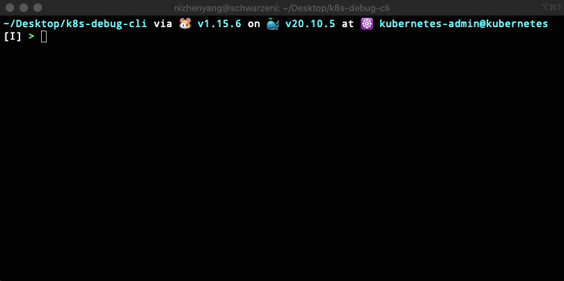
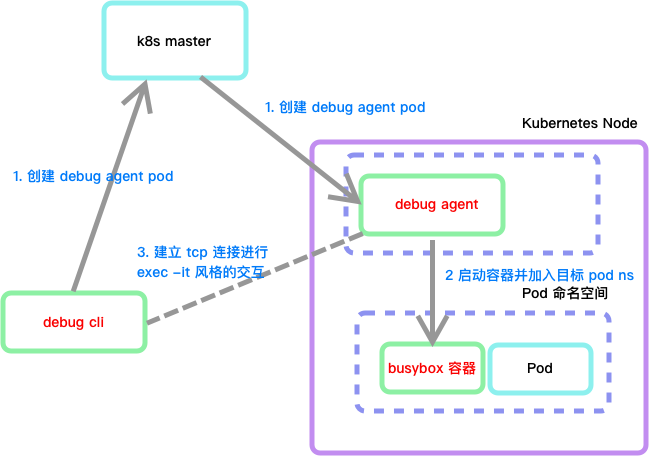

# k8s-debug-cli

一次偶然的机会看到了这篇文章 [《简化 Pod 故障诊断: kubectl-debug 介绍》]( https://aleiwu.com/post/kubectl-debug-intro/ )，感觉这个实现挺有意思的，准备自己实现一个。这里借鉴了文章中工具的[大体设计思路]( https://aleiwu.com/post/kubectl-debug-intro/#%E5%B7%A5%E4%BD%9C%E5%8E%9F%E7%90%86 )以及[获取容器 ID 的方式]( https://github.com/aylei/kubectl-debug/blob/24842b00e65449fb35bb33900f5c32d05bbac7a9/pkg/plugin/cmd.go#L762 )，其他的大体都是自己思考和实现的，同时，实现的功能比较粗糙，比如诊断容器写死为 busybox、只能进入 exec -it 风格的交互模式等、数据传输过程未加密、执行加入 Pod 中第一个容器的命名空间、容器运行时只能使用 docker 不兼容 containerd 等。

## 系统环境

- Kubernetes v1.19.0
- 容器运行时 Docker v19.03.11
- Golang v1.15.6
- 开发机与 Kubernetes 集群在同一子网 10.211.55.0/24 中
  - 开发机 macOS 10.211.55.2
  - k8s master 10.211.55.59
  - k8s node1 10.211.55.60
  - k8s node2 10.211.55.61
- 本地镜像仓库 10.211.55.2:10000

---

## 功能简介与实现效果

完整代码在 [https://github.com/schwarzeni/k8s-debug-cli](https://github.com/schwarzeni/k8s-debug-cli) 上。

执行 `debugcli -n <pod namespace> -p <pod name>` 之后，会进入到 busybox 容器的终端交互界面，类似于 `kubectl exec -it` 或 `docker exec -it` 的效果，而这个 busybox 容器和目标 pod 是位于同一网络、PID 等命名空间中的。



---

## 架构设计

其实跟上文中提到的 [kubectl-debug 的大体设计思路]( https://aleiwu.com/post/kubectl-debug-intro/#%E5%B7%A5%E4%BD%9C%E5%8E%9F%E7%90%86 ) 很像。



---

## 功能调研：远程终端

这个工具的本质，就是在节点1上进入节点2上的终端，这个虽然可以用 ssh 来实现远程登录，但是需要输入密码有点麻烦。这里采用最简单的 tcp 数据流的形式来实现，没有对数据进行加密。

首先安装相关的依赖

```go
go get -u golang.org/x/term
go get -u github.com/creack/pty
go get -u golang.org/x/crypto
```

这里第二个依赖是用来模型终端的，目前貌似只兼容了 \*nix，所以本节中开发环境需要在 \*nix 环境中，后面就没有这个要求了。

首先编写服务端 `cmd/remotecli/server/server.go`。数据流向大致如下

```txt
bash -- pty -- tcp
```

```go
package main

import (
  "fmt"
  "io"
  "log"
  "net"
  "os"
  "os/exec"
  "os/signal"
  "syscall"

  "github.com/creack/pty"
)

func handleConn(conn net.Conn) {
  ptmx, tty, _ := pty.Open()

  // Handle pty size. 否则类似于 htop 的命令，图像界面就无法正常显示
  ch := make(chan os.Signal, 1)
  signal.Notify(ch, syscall.SIGWINCH)
  go func() {
    for range ch {
      if err := pty.InheritSize(os.Stdin, ptmx); err != nil {
        log.Printf("error resizing pty: %s", err)
      }
    }
  }()
  ch <- syscall.SIGWINCH // Initial resize.

  go func() {
    c := exec.Command("/bin/bash")
    c.SysProcAttr = &syscall.SysProcAttr{}
    c.SysProcAttr.Setsid = true
    c.SysProcAttr.Setctty = true
    c.Stdin = tty
    c.Stdout = tty
    c.Stderr = tty
    _ = c.Start()
    _ = c.Wait()
    _ = ptmx.Close()
    signal.Stop(ch)
    close(ch)
    conn.Close()
  }()

  go func() {
    _, _ = io.Copy(ptmx, conn)
  }()
  _, _ = io.Copy(conn, ptmx)
}

func main() {
  listen, err := net.Listen("tcp", "0.0.0.0:30000")
  if err != nil {
    fmt.Println("listen failed, err:", err)
    return
  }
  defer listen.Close()
  conn, err := listen.Accept()
  if err != nil {
    fmt.Println("accept failed, err:", err)
    return
  }
  handleConn(conn)
}
```

再编写客户端端 `cmd/remotecli/client/client.go`

```go
package main

import (
  "fmt"
  "io"
  "log"
  "net"
  "os"

  "golang.org/x/crypto/ssh/terminal"
)

func main() {
  conn, err := net.Dial("tcp", "0.0.0.0:30000")
  if err != nil {
    fmt.Println("dial failed, err", err)
    return
  }
  defer conn.Close()

  if !terminal.IsTerminal(0) || !terminal.IsTerminal(1) {
    fmt.Errorf("stdin/stdout should be terminal")
  }
  // 这个应该是处理Ctrl + C 这种特殊键位，以及处理 stdin 输入
  oldState, err := terminal.MakeRaw(int(os.Stdin.Fd()))
  if err != nil {
    panic(err)
  }
  defer terminal.Restore(0, oldState)

  go func() {
    if _, err := io.Copy(conn, os.Stdin); err != nil {
      log.Println("io.Copy(conn, os.Stdin)", err)
    }
  }()
  if _, err := io.Copy(os.Stdout, conn); err != nil {
    log.Println("io.Copy(conn, os.Stdin)", err)
  }
  log.Println("client exit")
}
```

首先启动 server，然后再启动 client，发现 client 可以连接至 server 的 bash cli，vim、top 等命令可以正常执行。

---

## 功能调研：将容器加入至已有的命名空间

如果使用 docker cli 的话可以很方便地将新建的容器加入已有的容器命名空间中，例如如下命令，详细参考[ docker 的官方文档]( https://docs.docker.com/engine/reference/run/ )

```bash
docker run -it --network=container:$TARGET_ID busybox
```

那么如果用命令行模拟呢？

首先，安装 Docker 的 SDK

```bash
go get -u github.com/docker/docker
```

在文件 `cmd/nsjoin/nsjoin.go` 中尝试实现上述的逻辑

首先，需要用 docker 的 sdk 连接至 docker，查出目标容器的相关信息。目标容器的 ID 通过环境变量的形式获取

```go
// find container id
  targetContainerID, ok := os.LookupEnv("ENV_CONTAINER_ID")
  if !ok {
    log.Fatal("unable to find target container name in env")
  }
  
  // connect to docker
  ctx := context.Background()
  cli, err := client.NewClientWithOpts(client.WithHost("unix:///var/run/docker.sock"), client.WithAPIVersionNegotiation())
  if err != nil {
    log.Fatal("new docker client ", err)
  }
  log.Println("connect to docker")
  
  // find target container by id
  containers, err := cli.ContainerList(ctx, types.ContainerListOptions{
    Filters: filters.NewArgs(filters.KeyValuePair{
      Key:   "id",
      Value: targetContainerID,
    }),
  })
  if err != nil {
    log.Fatal("list containers ", err)
  }
  if len(containers) == 0 {
    log.Fatal("unable to find container with id " + targetContainerID)
  }
  targetContainer := containers[0]
```

随后需要创建新的容器，这里使用 busybox，首先现在容器镜像

```go
// find if image exists
  images, err := cli.ImageList(ctx, types.ImageListOptions{
    Filters: filters.NewArgs(filters.KeyValuePair{
      Key:   "reference",
      Value: "busybox:latest",
    }),
  })
  if err != nil {
    log.Fatal("search image ", err)
  }

  // if not, download it
  if len(images) == 0 {
    if _, err := cli.ImagePull(ctx, "docker.io/library/busybox:latest", types.ImagePullOptions{}); err != nil {
      log.Println("pull image ", err)
    }
    log.Println("pull image success")
  } else {
    log.Println("find local image cache")
  }
```

随后启动容器，将其加入 target container 的相关命名空间中，这里加入的命名空间有 Volume、Network、PID 和 IPC

```go
  resp, err := cli.ContainerCreate(ctx, &container.Config{
    Image: "busybox:latest",
    Cmd:   []string{"bin/sh", "-c", "tail -f /dev/null"},
  }, &container.HostConfig{
    // ref: https://docs.docker.com/engine/reference/run/
    VolumesFrom: []string{targetContainer.ID},
    IpcMode:     container.IpcMode("container:" + targetContainer.ID),
    NetworkMode: container.NetworkMode("container:" + targetContainer.ID),
    PidMode:     container.PidMode("container:" + targetContainer.ID),
    //UTSMode:     "",
    //UsernsMode:  ,
  }, nil, nil, "debug-for_"+targetContainerID+fmt.Sprintf("_%d", time.Now().Unix()))
  if err != nil {
    log.Fatal("create container ", err)
  }
  log.Println("create container success")

  if err := cli.ContainerStart(ctx, resp.ID, types.ContainerStartOptions{}); err != nil {
    log.Fatal("start container ", err)
  }
  log.Println("start container success")
```

随后，进入到 exec -it 交互模式，这里拿到的 `attchResp` 就类似于上一节中的 `exec.Command` ，作为输入和输入流的源头

```go
  execResp, err := cli.ContainerExecCreate(ctx, resp.ID, types.ExecConfig{
    Tty:          true,
    AttachStdin:  true,
    AttachStderr: true,
    AttachStdout: true,
    Cmd:          []string{"/bin/sh"},
  })
  if err != nil {
    log.Fatal("container exec create ", err)
  }
  log.Println("container exec create success")

  attchResp, err := cli.ContainerExecAttach(ctx, execResp.ID, types.ExecStartCheck{})
  if err != nil {
    log.Fatal("container exec attach ", err)
  }
  defer attchResp.Close()
  log.Println("container exec attach")
```

启动本地终端实现命令行交互

```go
// start cli
  oldState, err := term.MakeRaw(int(os.Stdin.Fd()))
  if err != nil {
   log.Fatal("make term stdin raw ", err)
  }
  defer func() { _ = term.Restore(int(os.Stdin.Fd()), oldState) }() // Best effort.

  // get output
  // ref https://stackoverflow.com/questions/52774830/docker-exec-command-from-golang-api
  go func() {
   _, _ = stdcopy.StdCopy(os.Stdout, os.Stderr, attchResp.Conn)
  }()
  _, _ = io.Copy(attchResp.Conn, os.Stdin)
```

最后清理容器

```go
_ = cli.ContainerRemove(ctx, resp.ID, types.ContainerRemoveOptions{Force: true})
```

对 `cmd/nsjoin/nsjoin.go` 进行交叉编译并 scp 到 k8s master 节点上

```bash
GOOS=linux GOARCH=amd64 go build -o nsjoin github.com/schwarzeni/k8s-debug-cli/cmd/nsjoin &&  scp nsjoin root@10.211.55.59:~/app
```

在 10.211.55.59 上做测试，尝试加入到 k8s-scheduler 容器的命名空间中，我这里它的容器 ID 是 de582c538892，执行如下命令

```bash
ENV_CONTAINER_ID=de582c538892 ./nsjoin
```

有如下输出。（由于 k8s 的 control plane 上的容器都是以 hostnetwork 的形式启动的，所以执行 ip addr 只会看到宿主机的网络配置）

```txt
root@kubeedge_edge_4: ~/app > ENV_CONTAINER_ID=de582c538892 ./nsjoin
2021/05/13 10:04:19 connect to docker
2021/05/13 10:04:19 find local image cache
2021/05/13 10:04:19 create container success
2021/05/13 10:04:20 start container success
2021/05/13 10:04:20 container exec create success
2021/05/13 10:04:20 container exec attach
/ # ps uax
PID   USER     TIME  COMMAND
    1 root      0:20 kube-scheduler --authentication-kubeconfig=/etc/kubernetes
   14 root      0:00 tail -f /dev/null
   19 root      0:00 /bin/sh
   25 root      0:00 ps uax

/ # ls /proc/1/root/etc/kubernetes/
scheduler.conf
```

---

## 功能调研：使用 client-go 与 k8s 交互

这里还需要先了解一下如何使用 client-go 来操作 pod。新建 `cmd/k8sclient/k8sclient.go` ，实现获取 kube-scheduler pod 容器的 ID 信息以及它所在集群节点的 IP 以及名称

首先，安装 client-go

```bash
go get -u k8s.io/client-go
go get -u k8s.io/apimachinery
go get -u k8s.io/api
```

首先，新建一个客户端，需要提供 kubeconfig 文件，这个文件一般是 k8s master node 的 `~/.kube/config` 

```go
  kubeconfigF := flag.String("f", "...", "absolute path to the kubeconfig file")
  podNameF := flag.String("p", "kube-scheduler-k8s-master", "pod's name")
  podNSF := flag.String("n", "kube-system", "pod's namespace")

  flag.Parse()
  config, err := clientcmd.BuildConfigFromFlags("", *kubeconfigF)
  if err != nil {
    log.Fatal("init config", err)
  }
  clientset, err := kubernetes.NewForConfig(config)
  if err != nil {
    log.Fatal("init client", err)
  }
```

然后，查找目标的 Pod

```go
  // import metav1 "k8s.io/apimachinery/pkg/apis/meta/v1"
  targetPod, err := clientset.CoreV1().Pods(*podNSF).Get(context.TODO(), *podNameF, metav1.GetOptions{})
  if err != nil {
    log.Fatal("get target pod", *podNameF, "in namespace", *podNSF, err)
  }
  if targetPod == nil {
    log.Fatal("pod " + *podNameF + " in namespace " + *podNSF + " not found")
  }
```

最后，从 targetPod 中提取出相关信息

```go
targetPodHostIP := targetPod.Status.HostIP
  targetPodHostName := targetPod.Spec.NodeName
  targetPodContainerID := func() string {
    targetContainerName := targetPod.Spec.Containers[0].Name
    for _, s := range targetPod.Status.ContainerStatuses {
      if s.Name == targetContainerName {
        // docker://.....
        return s.ContainerID[9:]
      }
    }
    log.Fatal("get container id not found ", targetContainerName)
    return ""
  }()
  log.Printf("\ntargetPodHostIP: %s\ntargetPodHostName: %s\ntargetPodContainerID: %s\n", 
    targetPodHostIP, targetPodHostName, targetPodContainerID)
```

运行程序，会得到类似如下输出


```txt
2021/05/13 10:29:51 
targetPodHostIP: 10.211.55.59
targetPodHostName: k8s-master
targetPodContainerID: de582c5388924db0876c8cef4c7a98ecd3222b81436b7289a70dac7e28d72f8e
```

---

## debug agent 开发

这个模块最终会以 pod 的形式，在调试开始时部署至 k8s 集群中，随后会启动 busybox 容器将其加入至目标容器的命名空间中，并与客户端建立起 tcp 连接，将 exec -it 的命令行交互数据通过 tcp 传输给客户端，数据流向如下

```txt
client ---- debug agent ---- busybox
```

新建文件 `cmd/debugagent/debugagent.go` ，关于如何启动 busybox 容器并将其加入至目标容器的命名空间中在之前的技术调研中已经涉及了，这里就不再赘述了。主代码如下：

```go
package main

import (
  "context"
  "fmt"
  "log"
  "os"
  "os/signal"
  "syscall"
  "time"

  "github.com/docker/docker/api/types"
  "github.com/docker/docker/api/types/container"
  "github.com/docker/docker/api/types/filters"
  "github.com/docker/docker/client"
)

var containerConnChan = make(chan types.HijackedResponse)
var debugFinishChan = make(chan struct{})

func main() {
  go tcpServer()

  // get container id from env
  targetContainerID, ok := os.LookupEnv("ENV_CONTAINER_ID")
  if !ok {
    log.Fatal("unable to find target container name in env")
  }

  // get docker client
  ctx := context.Background()
  cli, err := client.NewClientWithOpts(client.WithHost("unix:///var/run/docker.sock"), client.WithAPIVersionNegotiation())
  if err != nil {
    log.Fatal("new docker client ", err)
  }

  // search for target container by id
  containers, err := cli.ContainerList(ctx, types.ContainerListOptions{
    Filters: filters.NewArgs(filters.KeyValuePair{
      Key:   "id",
      Value: targetContainerID,
    }),
  })
  if err != nil {
    log.Fatal("list containers ", err)
  }
  if len(containers) == 0 {
    log.Fatal("unable to find container with id " + targetContainerID)
  }
  targetContainer := containers[0]

  // download busybox image
  images, err := cli.ImageList(ctx, types.ImageListOptions{
    Filters: filters.NewArgs(filters.KeyValuePair{
      Key:   "reference",
      Value: "busybox:latest",
    }),
  })
  if err != nil {
    log.Fatal("search image ", err)
  }
  if len(images) == 0 {
    if _, err := cli.ImagePull(ctx, "docker.io/library/busybox:latest", types.ImagePullOptions{}); err != nil {
      log.Println("pull image ", err)
    }
    log.Println("pull image success")
  } else {
    log.Println("find local image cache")
  }

  // create busybox container and join to target container ns
  resp, err := cli.ContainerCreate(ctx, &container.Config{
    Image: "busybox:latest",
    Cmd:   []string{"bin/sh", "-c", "tail -f /dev/null"},
  }, &container.HostConfig{
    // ref: https://docs.docker.com/engine/reference/run/
    VolumesFrom: []string{targetContainer.ID},
    IpcMode:     container.IpcMode("container:" + targetContainer.ID),
    NetworkMode: container.NetworkMode("container:" + targetContainer.ID),
    PidMode:     container.PidMode("container:" + targetContainer.ID),
    //UTSMode:     "",
    //UsernsMode:  ,
  }, nil, nil, "debug-for_"+targetContainerID+fmt.Sprintf("_%d", time.Now().Unix()))
  if err != nil {
    log.Fatal("create container ", err)
  }
  log.Println("create container success")

  // start container
  if err := cli.ContainerStart(ctx, resp.ID, types.ContainerStartOptions{}); err != nil {
    log.Fatal("start container ", err)
  }
  log.Println("start container success")

  // start exec -it
  execResp, err := cli.ContainerExecCreate(ctx, resp.ID, types.ExecConfig{
    Tty:          true,
    AttachStdin:  true,
    AttachStderr: true,
    AttachStdout: true,
    Cmd:          []string{"/bin/sh"},
  })
  if err != nil {
    log.Fatal("container exec create ", err)
  }
  log.Println("container exec create success")
  attchResp, err := cli.ContainerExecAttach(ctx, execResp.ID, types.ExecStartCheck{})
  if err != nil {
    log.Fatal("container exec attach ", err)
  }
  defer attchResp.Close()
  log.Println("container exec attach")

  containerConnChan <- attchResp

  sigs := make(chan os.Signal, 1)
  signal.Notify(sigs, syscall.SIGINT, syscall.SIGTERM)
  go func() {
    <-sigs
    _ = cli.ContainerRemove(ctx, resp.ID, types.ContainerRemoveOptions{Force: true})
    os.Exit(0)
  }()
  <-debugFinishChan
  _ = cli.ContainerRemove(ctx, resp.ID, types.ContainerRemoveOptions{Force: true})
}
```

`tcpServer` 函数用于创建  TCP server 与客户端建立连接实现远程终端。远程终端的实现思路在之前的技术调研中也涉及到了，这里就不再赘述了。

```go
func tcpServer() {
  defer func() { debugFinishChan <- struct{}{} }()
  listen, err := net.Listen("tcp", "0.0.0.0:30000")
  if err != nil {
    log.Println("listen failed, err:", err)
    return
  }
  defer listen.Close()
  conn, err := listen.Accept()
  defer conn.Close()
  if err != nil {
    log.Println("accept failed, err:", err)
  }
  cconn := <-containerConnChan

  go func() {
    _, _ = io.Copy(cconn.Conn, conn)
  }()
  _, _ = stdcopy.StdCopy(conn, conn, cconn.Conn)
}
```

至此 debug agent 编写完毕，需要将其打包成容器，现在如下的 Dockerfile。这里参考的是 kubebuilder 自动生成的 Dockerfile

```Dockerfile
# Build the manager binary
FROM golang:1.15 as builder

WORKDIR /workspace
# Copy the Go Modules manifests
COPY go.mod go.mod
# cache deps before building and copying source so that we don't need to re-download as much
# and so that source changes don't invalidate our downloaded layer
ENV GOPROXY https://goproxy.cn,direct
RUN go mod download

# Copy the go source
COPY cmd/debugagent/debugagent.go cmd/debugagent/debugagent.go
#COPY pkg/ pkg/

# Build
RUN CGO_ENABLED=0 GOOS=linux GOARCH=amd64 GO111MODULE=on go build -a -o debug-agent github.com/schwarzeni/k8s-debug-cli/cmd/debugagent

# Use distroless as minimal base image to package the manager binary
# Refer to https://github.com/GoogleContainerTools/distroless for more details
FROM gcr.io/distroless/static:nonroot
WORKDIR /
COPY --from=builder /workspace/debug-agent .

ENTRYPOINT ["/debug-agent"]
```

执行如下命令将镜像推送至位于 10.211.55.2:10000 的私有镜像仓库

```bash
docker build . -t 10.211.55.2:10000/debug-agent:v0.0.1
docker push 10.211.55.2:10000/debug-agent:v0.0.1
```

构建一个 pod 的 yaml 文件 `cmd/debugagent/deploy.yaml` 尝试将其部署至集群。这份文件仅用于测试。注意，其中的容器的环境变量 ENV_CONTAINER_ID 为 kube-scheduler 的 id，当然，你也可以换成别的 pod 的容器的 ip。 

```yaml
apiVersion: v1
kind: Pod
metadata:
  name: debug-agent
spec:
  hostNetwork: true
  nodeName: k8s-master
  volumes:
    - name: cri-sock
      hostPath:
        path: /var/run/docker.sock
  containers:
    - name: debug-agent-container
      image: 10.211.55.2:10000/debug-agent:v0.0.1
      env:
        - name: ENV_CONTAINER_ID
          value: de582c538892
      securityContext:
        runAsUser: 0 # warning，run as root，insecure
      volumeMounts:
        - mountPath: /var/run/docker.sock
          name: cri-sock
      ports:
        - containerPort: 30000
          hostPort: 30000
```

使用 kubectl 将其部署至 k8s 集群中

```bash
kubectl apply -f deploy.yaml
```

此时，可以利用之前技术调用远程终端中编写的 client （cmd/remotecli/client/client.go）尝试与其建立连接，只不过目标的 ip 需要改成 k8s master 的 ip。连接成功

```txt
/ # ls
bin   dev   etc   home  proc  root  sys   tmp   usr   var
/ # ps aux
PID   USER     TIME  COMMAND
    1 root      0:37 kube-scheduler --authentication-kubeconfig=/etc/kubernetes
   31 root      0:00 tail -f /dev/null
   37 root      0:00 /bin/sh
   44 root      0:00 ps aux
/ # 
```

执行命令删除测试 pod

```bash
kubectl delete -f deploy.yaml
```

---

## debug-cli 开发

接下来开始编写客户端工具，新建文件 `cmd/debugcli/debugcli.go` 开始编写。

首先，需要将上一节中部署用的 yaml 文件翻译成 golang 代码的形式

```go
var (
  debugAgentPodNS = corev1.NamespaceDefault // TODO: just in default ns
  DEBUG_AGENT_IMAGE = "10.211.55.2:10000/debug-agent:v0.0.1"
  DEBUG_AGENT_PORT  = 30000
)


// corev1 "k8s.io/api/core/v1"
// metav1 "k8s.io/apimachinery/pkg/apis/meta/v1"
func newDebugAgentPod(targetPod *corev1.Pod) *corev1.Pod {
  var runAsUserNum int64 = 0

  getContainerID := func() string {
    // TODO: target at first container in the pod ）
    targetContainerName := targetPod.Spec.Containers[0].Name
    for _, s := range targetPod.Status.ContainerStatuses {
      if s.Name == targetContainerName {
        // docker://.....
        return s.ContainerID[9:]
      }
    }
    log.Fatal("get container id not found ", targetContainerName)
    return ""
  }

  return &corev1.Pod{
    ObjectMeta: metav1.ObjectMeta{
      GenerateName: fmt.Sprintf("debug-agent-for-%s", targetPod.Name),
      Namespace:    debugAgentPodNS,
      Labels:       map[string]string{"debug-agent": targetPod.Name},
    },
    Spec: corev1.PodSpec{
      HostNetwork: true,
      NodeName:    targetPod.Spec.NodeName,
      Volumes: []corev1.Volume{
        {
          Name: "cri-sock",
          VolumeSource: corev1.VolumeSource{
            HostPath: &corev1.HostPathVolumeSource{Path: "/var/run/docker.sock"},
          },
        },
      },
      Containers: []corev1.Container{
        {
          Name:  "debug-agent-container",
          Image: DEBUG_AGENT_IMAGE,
          SecurityContext: &corev1.SecurityContext{
            RunAsUser: &runAsUserNum,
          },
          Ports: []corev1.ContainerPort{
            {ContainerPort: DEBUG_AGENT_PORT, HostPort: DEBUG_AGENT_PORT},
          },
          Env: []corev1.EnvVar{
            {
              Name:  "ENV_CONTAINER_ID",
              Value: getContainerID(),
            },
          },
          VolumeMounts: []corev1.VolumeMount{
            {
              Name:      "cri-sock",
              MountPath: "/var/run/docker.sock",
            },
          },
        },
      },
    },
  }
}
```

由于 client-go 创建并启动 Pod 是异步的形式，还需要编写一个函数用于等待 Pod 完全启动

```go
// waitForPodStart
// ref: https://github.com/feiskyer/go-examples/blob/master/kubernetes/pod-create/pod.go#L27
func waitForPodStart(ctx context.Context, client *kubernetes.Clientset, pod *corev1.Pod) (*corev1.Pod, error) {
  w, err := client.CoreV1().Pods(pod.Namespace).Watch(ctx, metav1.ListOptions{
    Watch:           true,
    ResourceVersion: pod.ResourceVersion,
    FieldSelector:   fields.Set{"metadata.name": pod.Name}.String(),
  })
  if err != nil {
    return nil, err
  }

  status := pod.Status
  func() {
    for {
      select {
      case events, ok := <-w.ResultChan():
        if !ok {
          return
        }
        pod = events.Object.(*corev1.Pod)
        status = pod.Status
        if pod.Status.Phase != corev1.PodPending {
          w.Stop()
        }
      case <-time.After(20 * time.Second):
        log.Println("timeout to wait for pod active")
        w.Stop()
      }
    }
  }()
  if status.Phase != corev1.PodRunning {
    return nil, fmt.Errorf("Pod is unavailable: %v", status.Phase)
  }
  pod.Status = status
  return pod, nil
}
```

现在可以开始编写主函数逻辑了。关于如何使用 client-go 与 k8s 进行交互的流程在之前的技术调研中已经提到，所以这里就不在赘述了。

```go
var (
  kubeconfig      = flag.String("f", "...", "absolute path to the kubeconfig file")
  podName         = flag.String("p", "kube-scheduler-k8s-master", "pod's name")
  podNS           = flag.String("n", "kube-system", "pod's namespace")
  debugAgentPodNS = corev1.NamespaceDefault // TODO: just in default ns
)

const (
  DEBUG_AGENT_IMAGE = "10.211.55.2:10000/debug-agent:v0.0.1"
  DEBUG_AGENT_PORT  = 30000
)

func init() {
  flag.Parse()
}

func main() {
  config, err := clientcmd.BuildConfigFromFlags("", *kubeconfig)
  if err != nil {
    log.Fatal("init config", err)
  }
  clientset, err := kubernetes.NewForConfig(config)
  if err != nil {
    log.Fatal("init client", err)
  }

  targetPod, err := clientset.CoreV1().Pods(*podNS).Get(context.TODO(), *podName, metav1.GetOptions{})
  if err != nil {
    log.Fatal("get target pod", *podName, "in namespace", *podNS, err)
  }
  if targetPod == nil {
    log.Fatal("target pod " + *podName + " not exist in ns " + *podNS)
  }

  daPod, err := clientset.CoreV1().Pods(debugAgentPodNS).Create(context.TODO(), newDebugAgentPod(targetPod), metav1.CreateOptions{})
  if err != nil {
    log.Fatal("create debug agent pod", err)
  }
  log.Println("create debug agent pod", daPod.Name, "success in ns", daPod.Namespace)

  daPod, err = waitForPodStart(context.TODO(), clientset, daPod)
  if err != nil {
    log.Fatal("wait for debug agent pod start", err)
  }
  log.Println("debug agent pod is start, try to get conn ..")

  // get ip
  addr := fmt.Sprintf("%s:%d", daPod.Status.HostIP, DEBUG_AGENT_PORT)
  var conn net.Conn
  retry := 5
  for {
    conn, err = net.Dial("tcp", addr)
    if err == nil {
      break
    }
    if retry--; retry == 0 {
      log.Fatal("dial to debug agent at ", addr, "failed", err)
    }
    time.Sleep(time.Second)
  }
  defer conn.Close()

  if !terminal.IsTerminal(0) || !terminal.IsTerminal(1) {
    fmt.Errorf("stdin/stdout should be terminal")
  }
  oldState, err := terminal.MakeRaw(int(os.Stdin.Fd()))
  if err != nil {
    panic(err)
  }
  defer terminal.Restore(0, oldState)

  go func() {
    if _, err := io.Copy(conn, os.Stdin); err != nil {
      log.Println("io.Copy(conn, os.Stdin)", err)
    }
  }()
  if _, err := io.Copy(os.Stdout, conn); err != nil {
    log.Println("io.Copy(conn, os.Stdin)", err)
  }
  log.Println("client exit")

  _ = clientset.CoreV1().Pods(debugAgentPodNS).Delete(context.TODO(), daPod.Name, metav1.DeleteOptions{})
}
```

尝试执行该程序，会有如下类似输出，中间出现卡顿可能是在下载 busybox 镜像。

```txt
2021/05/13 12:27:33 create debug agent pod debug-agent-for-kube-scheduler-k8s-masterxr984 success in ns default
2021/05/13 12:27:34 debug agent pod is start, try to get conn ..
/ # ps aux 
PID   USER     TIME  COMMAND
    1 root      0:47 kube-scheduler --authentication-kubeconfig=/etc/kubernetes
  106 root      0:00 tail -f /dev/null
  112 root      0:00 /bin/sh
  118 root      0:00 ps aux
/ # 
```

至此程序编写完毕
